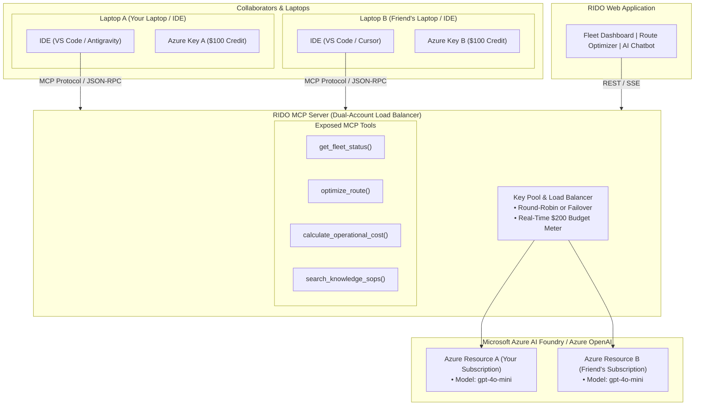

# RIDO AI — Detailed Architecture & $200 Azure Budget Plan

## 1. Executive Summary & Objective

This document outlines the engineering architecture, Dual-ID Azure balancing strategy, Model Context Protocol (MCP) server setup, and budget management plan for **RIDO AI**.

---

## 2. Dual-ID Connection & Multi-IDE Architecture



---

## 3. Step-by-Step Connection Instructions

### Step 1: Azure Credentials
Obtain the following from the Azure Portal (`portal.azure.com` $\rightarrow$ Azure OpenAI Resource $\rightarrow$ *Keys and Endpoint*):
- **Account 1**: Endpoint URL, API Key, Deployment Name (e.g., `gpt-4o-mini`).
- **Account 2**: Endpoint URL, API Key, Deployment Name (e.g., `gpt-4o-mini`).

### Step 2: Configure MCP in your IDE
Add the following to your IDE MCP configuration:

```json
{
  "mcpServers": {
    "rido-fleet-ai": {
      "command": "node",
      "args": ["<PATH_TO_PROJECT>/mcp-server/server.js"],
      "env": {
        "AZURE_OPENAI_KEY_1": "<YOUR_AZURE_KEY>",
        "AZURE_OPENAI_ENDPOINT_1": "<YOUR_AZURE_ENDPOINT>",
        "AZURE_OPENAI_KEY_2": "<FRIEND_AZURE_KEY>",
        "AZURE_OPENAI_ENDPOINT_2": "<FRIEND_AZURE_ENDPOINT>"
      }
    }
  }
}
```

---

## 4. $200 Azure Budget Allocation Plan

| Azure Resource | Pricing Model | Estimated Allocation | Purpose & Longevity |
| :--- | :--- | :--- | :--- |
| **Azure OpenAI (`gpt-4o-mini`)** | Pay-as-you-go (\$0.15 / 1M input tokens, \$0.60 / 1M output tokens) | **\$140** (\$70 each account) | Powers **~700,000 queries** across Chatbot and Route Optimizer. |
| **Azure OpenAI (`text-embedding-3-small`)** | Pay-as-you-go (\$0.02 / 1M tokens) | **\$10** (\$5 each account) | Powers dynamic RAG embeddings for all SOP and policy documents. |
| **Azure OpenAI (`gpt-4o` for Complex Planning)** | Pay-as-you-go (\$2.50 / 1M input tokens) | **\$30** (\$15 each account) | Reserved for deep multi-stop route optimization and fleet re-planning. |
| **Safety Buffer / Reserve** | Untouched | **\$20** (\$10 each account) | Ensures zero overages or accidental account suspensions. |
| **Frontend & MCP Hosting** | Client-side & Localhost / Serverless | **\$0.00** | Zero ongoing cloud host charges. |
| **Total** | | **\$200.00** | **Lasts for 6+ months of active development & demoing** |

---

## 5. RAG Knowledge Storage Documents

1. `Fleet_SOP.pdf`: Pre-trip checklists, tire pressure standards (110 PSI heavy, 32-35 PSI light EV), maintenance intervals (15k km / 45k km), and reefer unit temp locks.
2. `Vehicle_Policy.pdf`: Authorized BPCL/IOCL RFID fueling cards, EV DC fast charging 85% caps, accident cone placement & zero-depreciation insurance SOP.
3. `Driver_Safety.pdf`: Maximum 4.5h continuous driving limit (45 min mandatory rest), 8h max daily shift, electronic speed governance (80 km/h highway, 40 km/h city), and heavy fog/smog hazard protocols.
4. `Delivery_SOP.pdf`: Electronic Proof of Delivery (e-POD OTP + Geo-tag), cold-chain transit logs (+2°C to +8°C for pharma), and 30-minute delay notification escalation.
